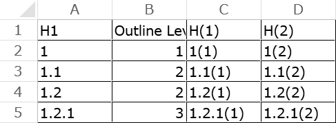
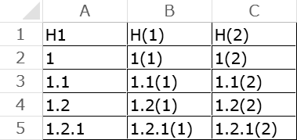
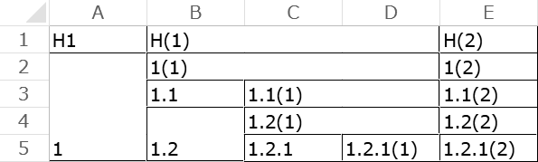

# Types of input

## `simple_text`

 * A text file consisting of multiple lines where:
   * `<line> ::= { <indent> } <key> { <delimiter> <value> }`
   * `<key>` : a text that does not start with `<indent>` and does not contain `<delimiter>` (if `<delimiter>` specified).
   * `<value>` : a text that does not contain `<delimiter>`.
   * `<indent>` : specified by `--from-indent` option
   * `<delimiter>` : specified by `--from-delimiter` option

## `dir_tree`

 * Directory tree with the glob pattern specified by `--from-glob-pattern` (default: `**/*`)

## `html_list`

 * HTML `<ul><li>` and/or `<ol><li>` [nesting list](https://www.w3.org/wiki/HTML_lists#Nesting_lists).
 * All text outside of `<li>` elements is ignored.

## `mspdi`

 * MS Project 20xx XML Data Interchange (i.e. files saved as "XML" format on MS Project).
 * Treat the task name as a key text, the other attributes as values.

## `opml`

 * [OPML](http://dev.opml.org/)
 * Treat the `text` attribute as a key text, the other attributes as values.

# Types of output

The sample input used in this section are as follows:

    1,1(1),1(2)
      1.1,1.1(1),1.1(2)
      1.2,1.2(1),1.2(2)
        1.2.1,1.2.1(1),1.2.1(2)

 * key header: H1, H2, H3
 * value header: H(1), H(2)

### common options

`--shironuri=yes` : fill all the cells with white color

## `xlsx_type0`

## `xlsx_type1`

### options for `xlsx_type1`

`--outline-rows=yes` : group rows

Not implemented (TODO):

 * Fill with different background color for each level.

## `xlsx_type2`

### options for `xlsx_type2`

`--integrate-cells={colspan,rowspan}` : group columns/rows.

`--outline-rows=yes` : group rows.

## `xlsx_type3`

### options for `xlsx_type3`

`--integrate-cells={colspan,rowspan,both}` : group columns/rows.

## `xlsx_type4`

### options for `xlsx_type4`

`--integrate-cells={colspan,rowspan,both}` : group columns/rows.

## `xlsx_type5`

### options for `xlsx_type5`

`--integrate-cells=colspan` : group columns/rows.

